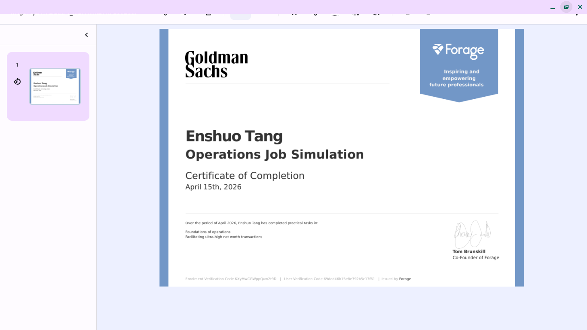
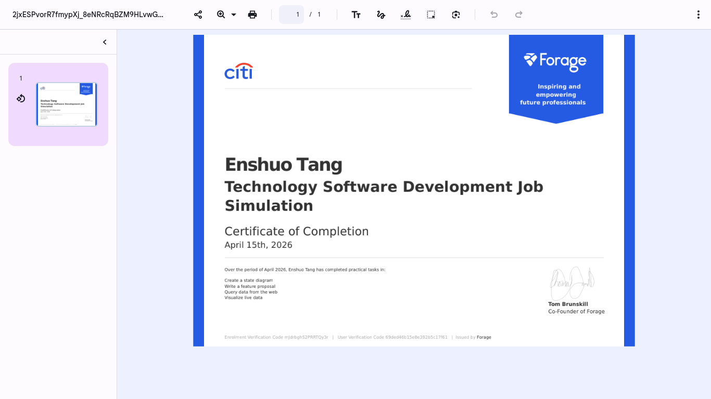
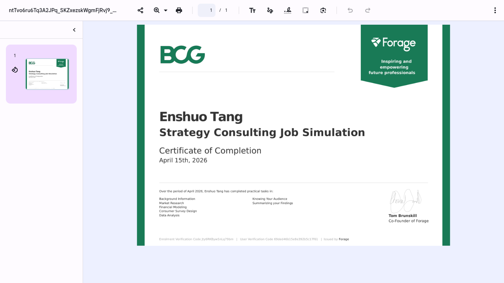

# 📈 QuantEdge: Institutional-Grade Market Simulator
### *Bridging Professional Financial Logic with Vanilla JavaScript Engineering*

---

## 🏛️ Project Overview
**QuantEdge** is a high-performance quantitative engine designed to simulate market volatility across 24 global sectors. This project was developed on a **restricted school Chromebook**, utilizing pure JavaScript to bypass hardware limitations while maintaining institutional-grade logic.

## 🏆 Professional Background & Credential Display
The core algorithms of QuantEdge are informed by practical simulations completed at leading global institutions. 

  
  

  
  

### 🔍 How these experiences shaped QuantEdge:
* **Goldman Sachs (Operations):** Integrated logic for *facilitating ultra-high net worth transactions* into the simulator's backend flow.
* **Citi (Software Development):** Implemented *live data visualization* and *complex state diagrams* to ensure the K-line charts update with zero latency.
* **BCG (Strategy):** Applied *financial modeling* and *market research* frameworks to define the volatility parameters of the 24 sectors.
* **Google (Education):** Structured the *data organization* logic to ensure the code remains clean and scalable.

## 🛠️ Technical Specifications
- **Core:** Custom Monte Carlo Stochastic Path Algorithm.
- **Performance:** Optimized for the Chrome V8 engine (Zero dependencies).
- **Environment:** Engineered entirely on ChromeOS.

## 📅 Launch Countdown
QuantEdge will officially debut on **Product Hunt** on **Tuesday, April 21, 2026**.

**Support the Launch:** [EnShuo Tang on Product Hunt](https://www.producthunt.com/@enshuo_tang)

---
*Developed by EnShuo Tang. Aiming for the intersection of Finance and Engineering.*
